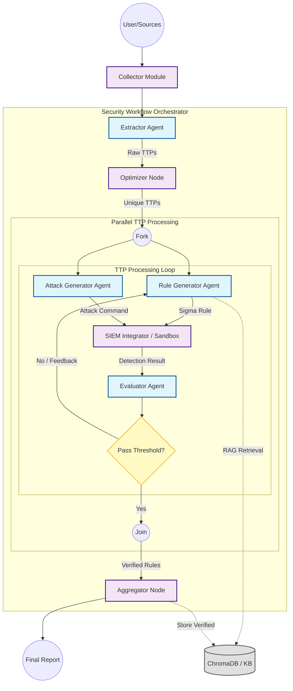

# Đề xuất thiết kế Workflow Diagram (Hình 3.2)

Dựa trên phân tích mã nguồn thực tế tại `core/graph.py` (đặc biệt là lớp `SecurityWorkflow` và phương thức `_process_single_ttp`), tài liệu này đề xuất cấu trúc biểu đồ luồng hoạt động để phản ánh chính xác cơ chế của Framework.

Biểu đồ cần thể hiện được tính chất **xử lý song song** (Parallel Processing) và **vòng lặp phản hồi cục bộ** (Local Feedback Loop) tại từng TTP, thay vì chỉ là một đường thẳng tuyến tính.

## Phân tích Luồng dữ liệu

1.  **Giai đoạn Khởi tạo (Initialization Phase):**
    *   **Collector Module:** Tiếp nhận dữ liệu từ nguồn (MISP/PDF), chuẩn hóa và chuyển đến Extractor.

2.  **Giai đoạn Tuần tự (Sequential Phase):**
    *   **Extractor Agent:** Trích xuất danh sách TTPs thô.
    *   **Optimizer:** Lọc trùng lặp và chọn lọc TTPs chất lượng cao.

3.  **Giai đoạn Xử lý Song song (Parallel Execution Phase):**
    *   Đây là điểm đặc biệt của hệ thống: Một luồng lớn tách ra thành nhiều luồng con (Sub-flows), mỗi luồng xử lý một TTP riêng biệt.
    *   Trong mỗi luồng con, hai tác nhiên chạy đồng thời: **RuleGen** (sinh luật) và **AttackGen** (sinh kịch bản tấn công).

4.  **Giai đoạn Kiểm chứng & Phản hồi (Verification & Feedback Loop):**
    *   **SIEM Integrator:** Kết hợp kết quả của RuleGen và AttackGen để kiểm thử trên Sandbox/Splunk.
    *   **Evaluator:** Đánh giá kết quả.
    *   **Decision Node:** Kiểm tra điều kiện `(Score > 0.7) AND (Detected == True)`.
        *   *Nếu Đạt:* Kết thúc luồng con.
        *   *Nếu Không Đạt:* Kích hoạt đường hồi quy (Feedback Edge) quay lại RuleGen để sửa luật.

5.  **Giai đoạn Tổng hợp (Aggregation Phase):**
    *   Gộp kết quả từ tất cả luồng con để tạo báo cáo cuối cùng.

## Mã Mermaid đề xuất

